# System Patterns

## Architecture Overview

The Web3 Integration Framework employs a modular, layered architecture designed to provide consistent interfaces across diverse blockchain ecosystems while accommodating their unique capabilities.

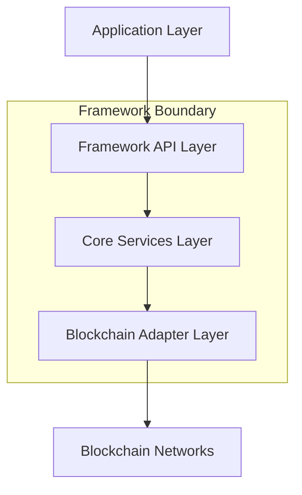

### Layer Responsibilities

1. **Framework API Layer**
   - Provides unified interfaces for applications
   - Handles configuration and initialization
   - Manages feature discovery and capability exposure

2. **Core Services Layer**
   - Implements cross-cutting concerns (logging, error handling)
   - Provides utility services (serialization, validation)
   - Handles common workflows independent of blockchain specifics

3. **Blockchain Adapter Layer**
   - Translates between unified API and blockchain-specific implementations
   - Handles protocol-specific details and quirks
   - Implements optimizations for specific chains

## Design Patterns

### Adapter Pattern

The framework heavily leverages the Adapter pattern to normalize interactions with different blockchain networks:

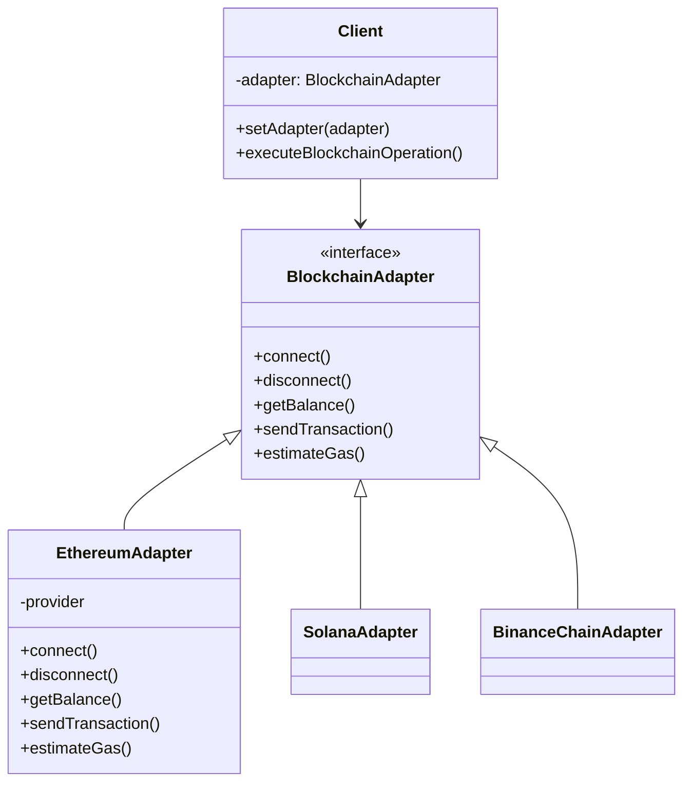

### Factory Method Pattern

Factory methods create appropriate adapters and services based on configuration:

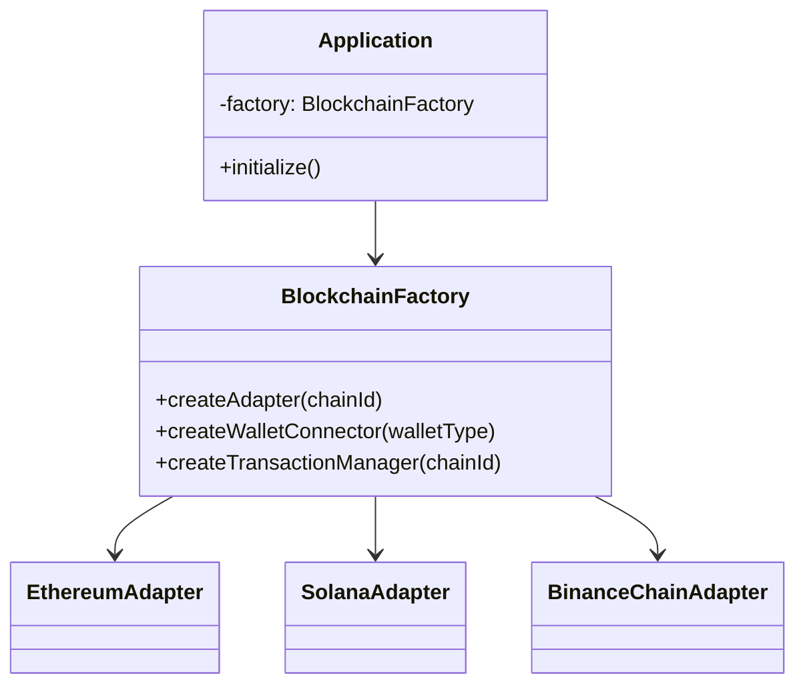

### Observer Pattern

Event-driven architecture for asynchronous blockchain interactions:

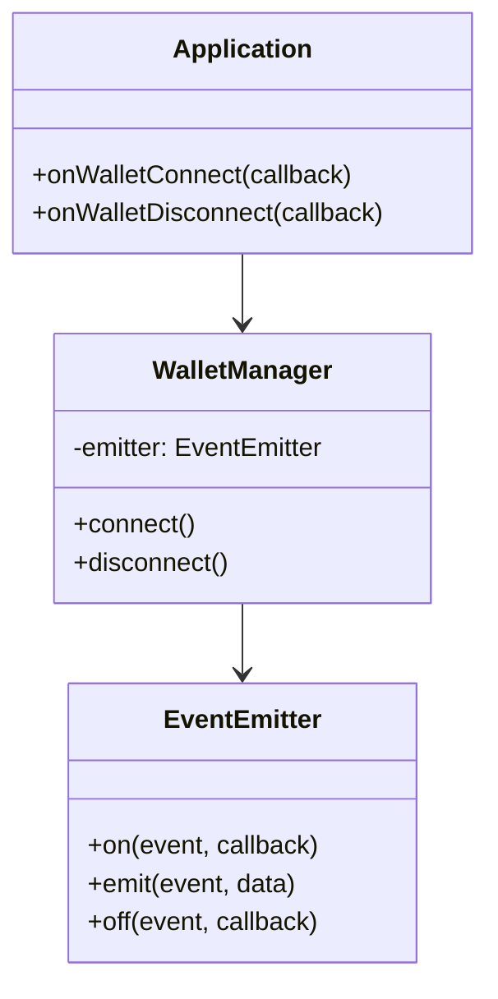

### Strategy Pattern

Different strategies for transaction submission, signing, and fee calculation:

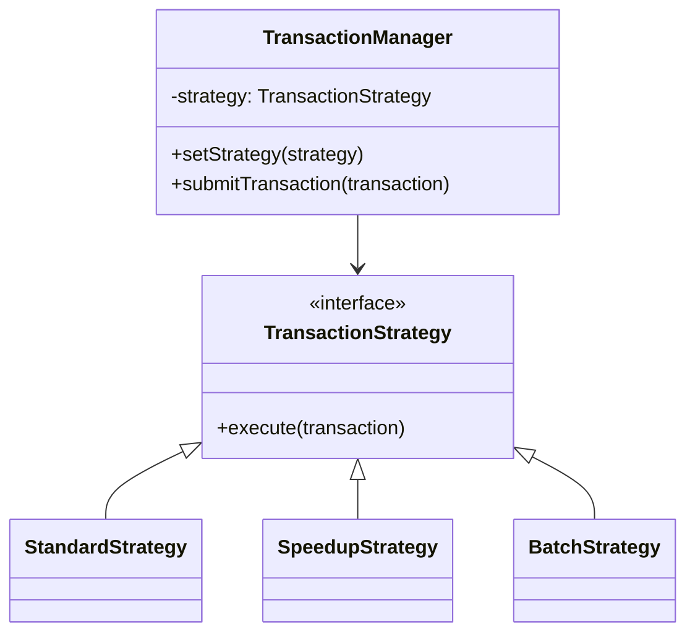

### Facade Pattern

Simplified interfaces hiding complex subsystem interactions:

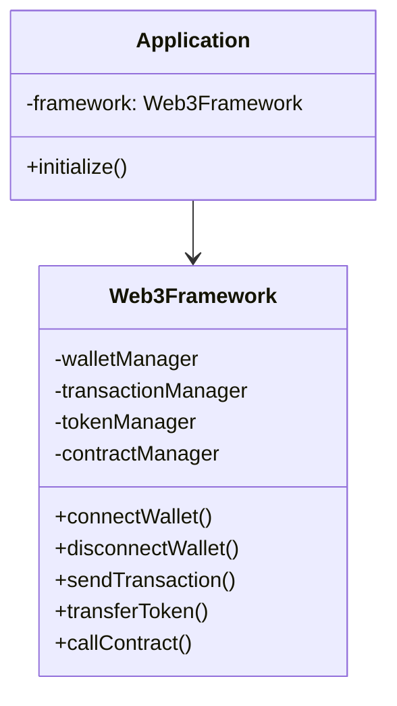

## Module Organization

The framework is organized into cohesive modules:

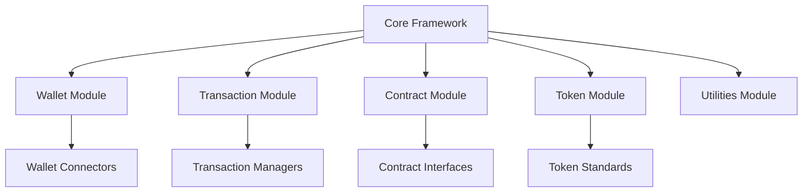

## Data Flow Patterns

### Wallet Connection Flow

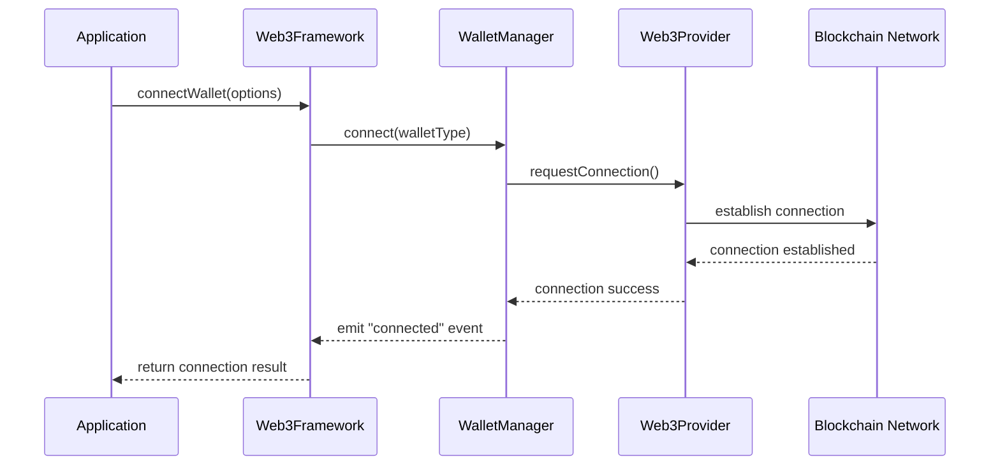

### Transaction Submission Flow

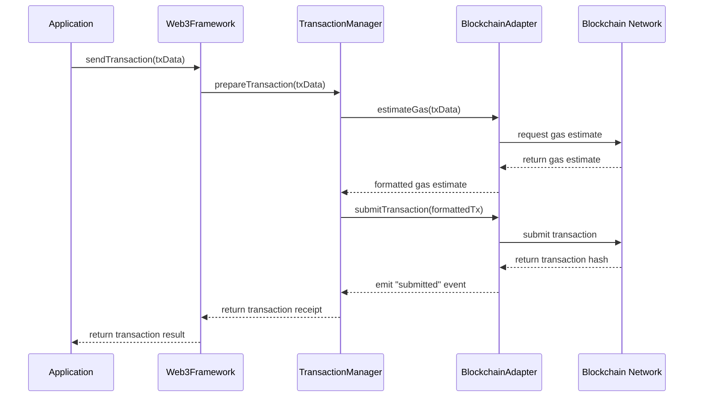

## Error Handling Patterns

The framework implements a consistent error handling approach:

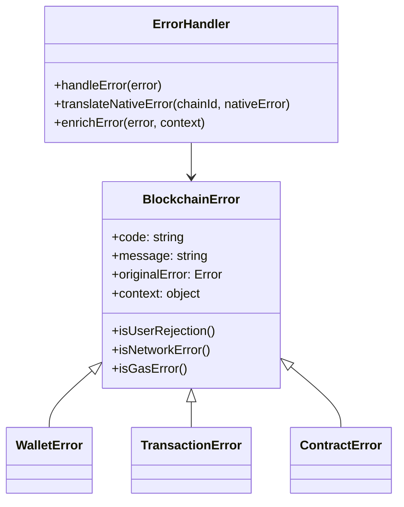

## State Management Patterns

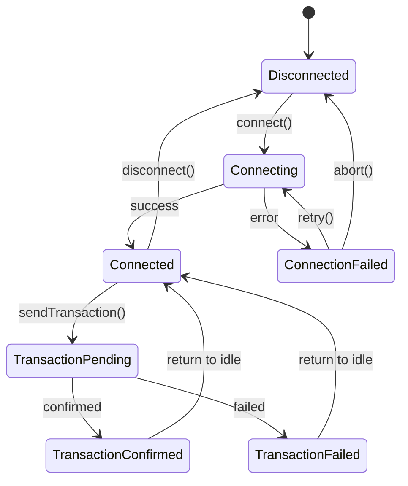

## Extension Patterns

The framework supports extensibility through plugin and custom adapter patterns:

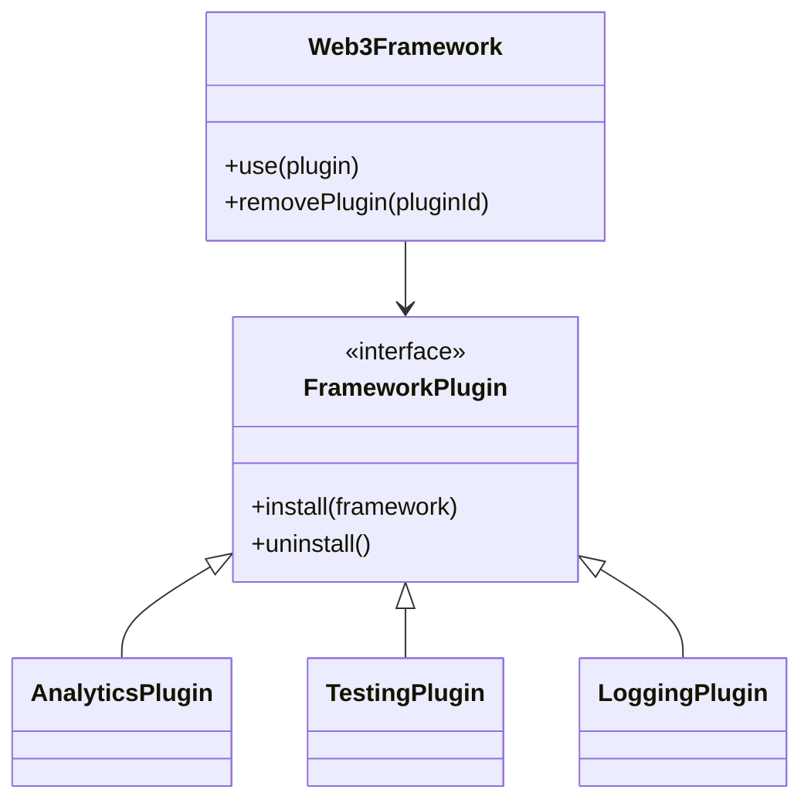

## Testing Patterns

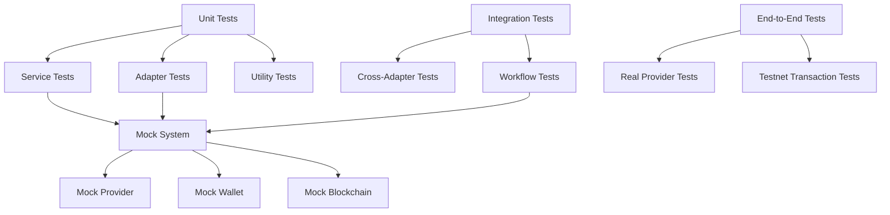

## Performance Optimization Patterns

The framework incorporates several performance optimization strategies:

1. **Lazy Loading**: Components are loaded only when needed
2. **Connection Pooling**: Reuse of blockchain connections
3. **Batch Processing**: Combining compatible operations
4. **Caching Layer**: Frequently used data is cached
5. **Parallel Processing**: Independent operations executed concurrently

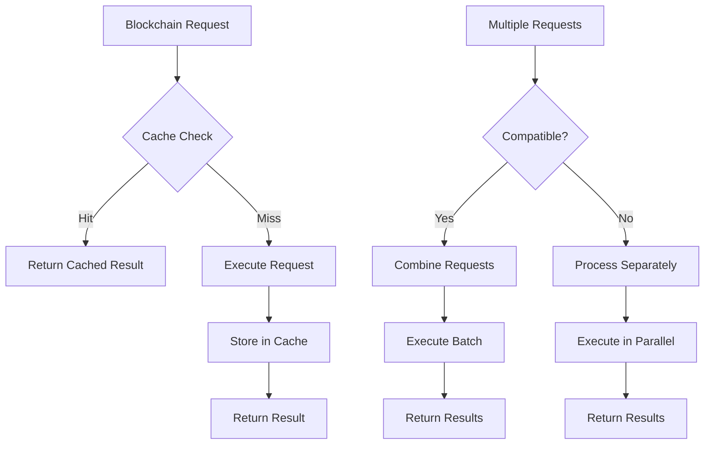

## Security Patterns

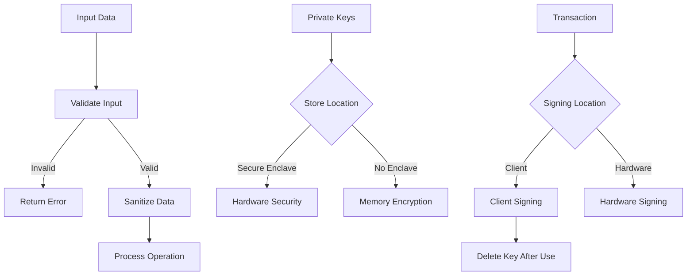